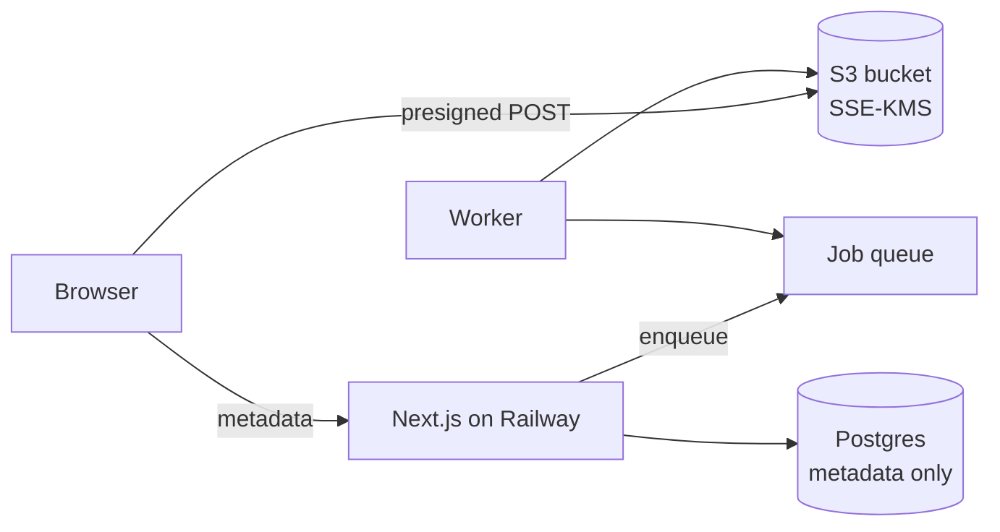
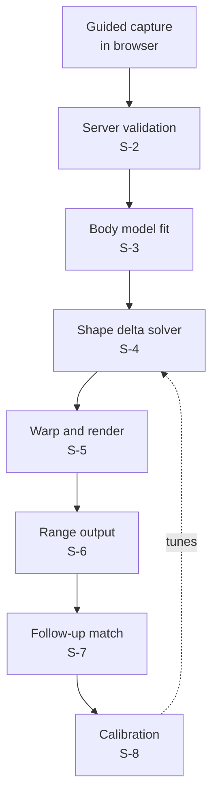

# MeltAwayMD — Remediation, Photo Infrastructure & Body Simulator

## Phased Build Plan

2026-09-19 · @Someone

## How to use this doc

The three phases are numbered by launch order, not by development order. Phase 1 closes exposure that exists in production today. Phase 2 builds infrastructure that both the planned Before & After Gallery and the simulator need. Phase 3 is the simulator.

**What actually blocks what:**

- **Phase 1 does not block simulator development.** R-1 through R-11 are independent of the photo work and can proceed on their own track, in parallel, by whoever is free. Nothing in Phase 3 waits on them.
- **Phase 1 P0s do block launch.** No patient photo goes in front of a real user while R-1, R-2 or R-3 are open. Assume tracking scripts are live on authenticated routes until proven otherwise.
- **Phase 2 genuinely blocks most of Phase 3.** There is no storage, no owner-scoping helper, no worker and no consent record to build against. The exceptions are S-1 and S-4, which can be prototyped standalone and are the two worth starting earliest — S-1 because it has the most unknowns, S-4 because it is the core modeling work.
- **P-7 is the only ticket that touches the tracking problem.** It keeps photo and patient identifiers out of URLs entirely, which is the right design whether or not pixels are present, so it needs no change either way.

Audience is Claude Code working in the MeltAwayMD repo. Findings cited below come from the PHI-readiness codebase survey dated 2026-09-06.

Every ticket carries **Problem** (what is wrong, with the file path), **Work** (what to change), and **Done when** (testable acceptance criteria).

Conventions that apply to all work in this plan:

- Health data, identifying data, and anything derived from a patient photo never enters stdout, a URL path, a query string, or a third-party script's reach.
- New patient-facing endpoints use the shared authorization helper from Phase 2, never inline role checks.
- Every schema change ships with a Prisma migration. No manual DDL.
- Anything that can fail slowly (image processing, external calls) runs in the worker, not in a request handler.
- When a ticket cannot be completed without a decision this doc does not make, stop and surface it. See Open questions.

## Phase 1 — Remediation

Six P0 items are live exposure right now and none of them depend on the photo feature. Close all six before touching Phase 2. The P1 items are hardening that the photo work will rest on and should follow immediately.

| ID | Title | Priority |
| --- | --- | --- |
| R-1 | Remove ad pixels from authenticated routes | P0 |
| R-2 | Constrain or remove arbitrary script injection | P0 |
| R-3 | Stop logging health data to stdout | P0 |
| R-4 | Remove health data from outbound URLs | P0 |
| R-5 | Purge secrets and real data from git history | P0 |
| R-6 | Rate-limit OTP verification | P0 |
| R-7 | Separate encryption key from session secret | P1 |
| R-8 | Encrypt TOTP secrets at rest | P1 |
| R-9 | Harden patient session and phone lookup | P1 |
| R-10 | Enforce retention cleanup | P1 |
| R-11 | Role-check the portal layout | P1 |

### R-1 — Remove ad pixels from authenticated routes (P0)

**Problem.** `src/components/tracking/TrackingScripts.tsx` loads GA4, GTM, Google Ads, Meta Pixel, TikTok Pixel and Bing UET on every route, including `/portal` and `/admin`. Those vendors receive the URL of every page an authenticated patient of a weight-loss service views. This is the fact pattern behind the FTC actions against GoodRx, BetterHelp and Cerebral, and behind HHS OCR's tracking-technology guidance.

**Work.** Scope tracking scripts to marketing routes only. Gate at the layout level rather than per-page so a new authenticated route cannot accidentally inherit them. Confirm `trackLead` and `trackContact` in the same module stay uncalled, or delete them — they send email and phone to ad pixels.

**Done when**

- No tracking script tag renders on any route under `/portal` or `/admin`, verified by fetching the HTML of at least one page in each and grepping for the vendor domains.
- A new route added under `/portal` inherits no tracking without a code change.
- A test asserts the marketing-only scoping so a future refactor cannot silently re-enable it.

### R-2 — Constrain or remove arbitrary script injection (P0)

**Problem.** The `headScripts` and `bodyScripts` fields in the admin tracking settings inject unreviewed HTML site-wide, including authenticated pages. Any session-replay or analytics tool can be added with no code review, and the photo pages would be inside its reach.

**Work.** Preferred: remove the fields. If they must stay, restrict injection to marketing routes only and validate against an allowlist of permitted script origins. Also read the live config and report what is currently in those fields — this is one of the unknowns the survey flagged.

**Done when**

- Custom scripts cannot render on `/portal` or `/admin` under any settings value.
- The current live contents of both fields are reported.
- If retained, a value outside the allowlist is rejected at write time with a clear admin-facing error.

### R-3 — Stop logging health data to stdout (P0)

**Problem.** Full intake questionnaires, contact details and health summaries are written to stdout and land in Railway's log drain. Known sites: `src/app/api/intake/route.ts` lines 977-1178, `src/lib/zoho.ts` lines 1296 and 1352, `src/app/api/support/route.ts` line 784. `sanitizeForLogging` exists at `src/lib/api-utils.ts` line 1417 and has no callers.

**Work.** Route all application logging through a wrapper that applies `sanitizeForLogging` by default. Replace the identified call sites. Audit for any other site logging a request body, a Prisma result containing patient fields, or a caught error whose message may embed one.

**Done when**

- A full intake submission run end to end in a dev environment produces logs containing no name, email, phone, DOB, health answer, or medication name.
- Grepping the codebase for direct `console.log`/`console.error` with an object argument returns only sites that have been reviewed and annotated.
- A test submits a known payload and asserts none of its sentinel values appear in captured log output.

### R-4 — Remove health data from outbound URLs (P0)

**Problem.** The weight-assessment email in `src/lib/email.ts` links to calculator.net with age, sex, height and weight in the query string. Those values land in a third party's access logs and in any referrer chain.

**Work.** Compute BMI server-side, render the result in the email body, and drop the external link. Sweep for any other outbound URL carrying patient values as parameters.

**Done when**

- No outbound link generated anywhere in the codebase contains a patient attribute as a query parameter or path segment.
- The assessment email still shows BMI and eligibility, computed locally.

### R-5 — Purge secrets and real data from git history (P0)

**Problem.** `prisma/dev.db` is a tracked SQLite database containing real User, AuditLog and SmsConsent rows including roughly fifteen email-like strings. `cookies.txt` is a tracked curl cookie jar with NextAuth CSRF and callback values. Five Railway deploy logs are tracked under `railwaylogs/` and reference tokens.

**Work.** Rewrite history to remove all four paths. Rotate any credential that appeared in them, including NextAuth secrets. Add `.gitignore` entries. Confirm no remaining tracked file contains real patient data — `AsherMed/prescriptions.jpg` is a product catalog screenshot and can stay.

**Done when**

- The four paths are absent from every commit reachable from any branch or tag.
- Every credential exposed in them has been rotated.
- `.gitignore` covers `*.db`, `cookies.txt` and `railwaylogs/`.

### R-6 — Rate-limit OTP verification (P0)

**Problem.** `src/app/api/auth/verify-code/route.ts` has no rate limiting. A six-digit code can be attempted within Twilio's own cap, and success mints a 30-day session with access to patient health records. Existing rate limiting is file-based per process and in-memory for chat, so it survives neither restart nor a second replica.

**Work.** Add server-side rate limiting keyed on phone and IP to both `verify-code` and `send-code`. Back it with Postgres or Redis rather than the filesystem, so it works across restarts and replicas. Lock the identifier after a small number of failures with a cooldown.

**Done when**

- Repeated wrong codes for one phone are refused after a defined threshold and the lockout is recorded in the audit log.
- The limiter's state survives a container restart.
- The same limit applies with two replicas running.

### R-7 — Separate encryption key from session secret (P1)

**Problem.** `src/lib/encryption.ts` derives its AES-256-GCM key from `NEXTAUTH_SECRET`, so session signing and data encryption share one value. An `ENCRYPTION_SECRET` env name is referenced but is not what the key derivation uses. Rotating the session secret would destroy encrypted data.

**Work.** Derive the data key from `ENCRYPTION_SECRET` only. Support rotation by versioning the key and tagging each ciphertext with its key version. Write a migration path for the existing Zoho token ciphertext.

**Done when**

- Rotating `NEXTAUTH_SECRET` invalidates sessions and decrypts existing data correctly.
- Ciphertexts carry a key version and the decrypt path handles more than one active version.
- A documented rotation procedure exists for `ENCRYPTION_SECRET`.

### R-8 — Encrypt TOTP secrets at rest (P1)

**Problem.** `User.totpSecret` is stored in plaintext. Anyone with a database read has a second factor for every admin.

**Work.** Encrypt on write with the Phase R-7 key, decrypt on verify, and migrate existing rows.

**Done when**

- No plaintext TOTP secret remains in the database.
- TOTP login works for a pre-existing enrolled admin after migration.

### R-9 — Harden patient session and phone lookup (P1)

**Problem.** Patient sessions last 30 days and are minted manually with `encode()` outside NextAuth's normal flow in the two verify routes. The passwordless login path in `src/app/api/auth/send-code/route.ts` matches users on the last ten digits of the phone with `contains`, which is not an exact-match lookup.

**Work.** Shorten patient session lifetime — 7 days is a reasonable target, with the trusted-browser cookie carrying the longer window. Move session minting into a single reviewed helper. Normalize phone numbers to E.164 on write and match exactly on read.

**Done when**

- Session minting happens in exactly one place, covered by tests.
- Phone lookup uses an exact match on a normalized column with a unique constraint.
- Existing phone rows are migrated to E.164.

### R-10 — Enforce retention cleanup (P1)

**Problem.** `cleanupExpiredAuditLogs` in `src/lib/audit.ts` and `cleanupExpiredTrustedBrowsers` in `src/lib/trustedBrowser.ts` exist and are never called, so the 90-day audit retention noted in the schema is not enforced. Audit `details` currently stores chat prompts and responses.

**Work.** Run both on a schedule. Since Phase 2 introduces a worker, this can land as a worker job, or as a Railway cron if Phase 2 has not started. Separately, stop writing chat prompt and response bodies into `AuditLog.details` — record an event reference instead.

**Done when**

- Both cleanup functions run on a schedule and the run is observable.
- Audit rows past their expiry are actually deleted, verified against a seeded fixture.
- No new audit row contains a chat prompt or response body.

### R-11 — Role-check the portal layout (P1)

**Problem.** `src/app/portal/layout.tsx` gates on the presence of any session rather than on role. Admin route checks are repeated inline in each route rather than centralized.

**Work.** Check role explicitly in the portal layout. Extract the repeated admin check into one helper and replace the inline copies. This helper is the seed of the owner-scoping work in Phase 2.

**Done when**

- An admin-role session cannot load patient portal pages, and vice versa, verified by test.
- No route file contains an inline role string comparison.

## Phase 2 — Photo infrastructure

Nothing in the repo today can hold a patient photo safely: there is no object storage, no patient-owned-record authorization pattern, no worker, no image libraries, and no consent capture. This phase builds that foundation. It is shared with the Before & After Gallery already planned in `docs/updates/2026_04_10.md`, so the cost is not simulator-specific.

**Target shape.** Railway keeps the Next.js app and Postgres. Image bytes never transit Railway: the browser uploads directly to S3 with a presigned POST, and the GPU work in Phase 3 reads from the same bucket. Postgres holds metadata only.



| ID | Title | Depends on |
| --- | --- | --- |
| P-1 | Object storage with presigned direct upload | R-5 |
| P-2 | Envelope encryption and key management | R-7 |
| P-3 | Shared owner-scoping helper | R-11 |
| P-4 | Photo data model | P-1, P-2 |
| P-5 | Background worker and queue | — |
| P-6 | Image intake hygiene | P-5 |
| P-7 | Authenticated, non-leaking photo delivery | P-3, P-4, R-1 |
| P-8 | Consent capture and policy surface | P-4 |
| P-9 | Retention and deletion | P-4, P-5 |

### P-1 — Object storage with presigned direct upload

**Problem.** The two existing upload paths are both unusable as patterns. `src/app/api/admin/branding/route.ts` writes to `public/branding/` on the container filesystem, which is lost on redeploy. `src/app/api/admin/instagram-sync/route.ts` stores bytes in a Postgres `Bytes` column served from an unauthenticated public route with a day-long cache header. Neither goes near patient photos.

**Work.** Provision an S3 bucket with SSE-KMS, versioning off, public access fully blocked, and a bucket policy denying unencrypted puts. Add an endpoint that issues a presigned POST scoped to one object key, a content-length range, and a short expiry. The browser uploads directly; the app never receives the bytes. Keys are opaque UUIDs with no patient identifier in the path.

**Done when**

- A photo can be uploaded from the browser to S3 without its bytes passing through the Next.js process.
- Presigned credentials expire in minutes, permit exactly one key, and enforce a size cap.
- Object keys contain no user id, email, phone or name.
- An unauthenticated request to the bucket or to any object URL is refused.

### P-2 — Envelope encryption and key management

**Problem.** There is no place to put a data-encryption key. R-7 separates the data key from the session secret, but photos warrant envelope encryption rather than one long-lived application key.

**Work.** Use KMS for the data key, with a per-photo data key wrapped and stored beside the metadata row. Support key rotation without re-encrypting every object. Ensure a database dump alone is insufficient to decrypt anything.

**Done when**

- Each photo has its own wrapped data key.
- Rotating the KMS key leaves existing photos readable.
- A Postgres dump plus the application env contains nothing sufficient to decrypt a photo without KMS access.

### P-3 — Shared owner-scoping helper

**Problem.** The survey found no patient-owned-record pattern to reuse. `src/app/api/support/route.ts` lines 817-820 filters by `userId` and is the only example. Patients cannot read their own questionnaire, notes or profile through any API today. Admin checks are inline strings repeated across routes.

**Work.** Build one helper that, given a session and a record type plus id, returns the record or refuses. It must handle: patient reads own record, admin reads any, everyone else refused. There is one admin account today, so only those two roles exist — but structure the helper so a provider or staff tier can be added without reworking every call site. Route every new patient-facing endpoint through it. Retrofit the support route. Make the failure mode refusal, not an empty result, so a bug surfaces loudly.

**Done when**

- One helper is the only path to a patient-owned record, enforced by lint rule or test.
- A patient requesting another patient's photo id receives a refusal, verified by test.
- The helper is covered for all three role cases plus the no-session case.

### P-4 — Photo data model

**Problem.** No schema exists for photos, captures, consent, or simulation runs.

**Work.** Add Prisma models for the photo record (owner, S3 key, wrapped data key, content type, dimensions, capture timestamp, capture parameters, quality scores, consent reference, retention date) and a capture-session record linking photos taken as a set. Store measurement and fit data as structured columns rather than free-text JSON, so retention and redaction can target them.

Do not put photo-derived body measurements into `AuditLog.details` or any free-text field.

**Done when**

- Migration applies cleanly and rolls back.
- Every photo row has a non-null owner, consent reference and retention date.
- No photo bytes are stored in Postgres.

### P-5 — Background worker and queue

**Problem.** No job queue, worker or cron exists. The only async pattern is one fire-and-forget SMS call. Everything else, including three sequential Zoho calls, runs inside the request. Rate limiting is file-based per process. The app container is 512 MB. Railway currently runs two services, the app and Postgres, each with its own volume; the worker is a third.

**Work.** Add a durable queue backed by Postgres or Redis, and a worker process as a second Railway service. Move image hygiene, retention sweeps and the R-10 cleanup jobs onto it. Design job payloads to carry ids, never patient data, so a queue inspection reveals nothing.

**Done when**

- A worker service runs separately from the web service and survives web restarts.
- Jobs are retried with backoff and a failed job is visible.
- No job payload contains a name, email, phone, health value or photo byte.

### P-6 — Image intake hygiene

**Problem.** No image libraries are present — no sharp, no EXIF handling, no content sniffing. The branding route checks MIME type and extension only; the Instagram route has no size limit at all.

**Work.** In the worker: verify the object is genuinely an image by decoding it, strip all EXIF including GPS, normalize orientation, re-encode to a known format, and generate derivatives. Enforce dimension and size bounds. Reject anything that fails to decode.

**Done when**

- A processed photo carries no EXIF, verified by inspecting output bytes.
- A file with an image extension but non-image content is rejected and the original deleted.
- Processing a large upload does not run inside a request handler.

### P-7 — Authenticated, non-leaking photo delivery

**Problem.** The Instagram pattern serves bytes from an unauthenticated route with a long cache header. Applied to body photos that is a breach with a CDN in front of it. Separately, until R-1 ships, any URL containing a photo or patient id flows to ad pixels.

**Work.** Serve photos only through short-lived presigned GET URLs issued after the P-3 check. No photo identifier appears in a page URL — pass it in the request body or as an opaque non-enumerable token. Set no-store on responses. Confirm no referrer leaks the URL.

**Done when**

- A photo URL expires in minutes and is unusable afterwards.
- No route path or query string anywhere contains a photo or patient identifier.
- A photo response carries no-store and no public cache header.
- Photo pages load with no third-party script present.

### P-8 — Consent capture and policy surface

**Problem.** `src/app/privacy/page.tsx` and `src/app/terms/page.tsx` are static React last updated February 2025. Neither mentions photos, images or biometric data. Neither states a retention period, names subprocessors, or obtains consent to use customer data for product improvement. The only consent capture in code is the SMS checkbox. Illinois BIPA and Washington's My Health My Data Act require specific written consent for biometric data, and a generic "improve our services" clause does not cover a training use.

**Work.** Build a versioned consent record: consent text, version, timestamp, IP, user agent, and the specific purposes agreed. Separate the purposes — capturing a photo for the patient's own use is one consent; using it to calibrate a model is a second, independently opt-in. Store the exact text shown, not a reference to it, so a later policy edit cannot rewrite history. Gate all photo capture on a current consent. Consent must be capturable at intake, before an account exists in any meaningful sense, and must survive if that person later converts — one consent record, not two. Draft the privacy and terms language covering photos, biometric data, retention period, named subprocessors and the training opt-in.

**Done when**

- No photo can be captured or stored without a matching current consent row.
- Consent for the training use is separately recorded and defaults to off.
- The exact consent text shown is stored per record and is immutable.
- Withdrawing consent is possible and triggers P-9 deletion.
- Draft policy language exists for review.

### P-9 — Retention and deletion

**Problem.** No retention logic exists for any data type, and the existing cleanup functions never run (R-10). The privacy policy promises no retention period.

**Work.** Give every photo a retention date at write time, with a shorter clock for people who completed intake but never started the program. A worker job deletes expired objects from S3 and their metadata rows. Provide a patient-initiated delete that removes the object, its derivatives, the metadata and any simulation output derived from it. Verify deletion is real, including any cached derivative.

**Done when**

- An expired photo is gone from S3 and Postgres, verified by a seeded fixture.
- A patient delete request removes the original, every derivative, and every derived simulation.
- A deleted photo's presigned URLs stop working immediately.
- Retention behavior matches whatever period the P-8 policy states.

## Phase 3 — Simulator

The approach is to warp the patient's own pixels, not to generate a new person. A parametric body model is fitted to the photo, its shape parameters are re-evaluated at the target weight while preserving what is individual about this person, and the resulting geometric change drives a dense warp of the original image. Identity is preserved because no new person is ever synthesized, and the result is reproducible and explainable — which a diffusion model's output is not.

**Split.** Railway keeps the app, the capture UI and the metadata. The fitting, solving and warping run on a GPU host reading from the S3 bucket built in P-1. Railway has no GPU offering.



| ID | Title | Notes |
| --- | --- | --- |
| S-1 | Guided capture UI | Build and user-test first |
| S-2 | Server-side validation tiers |  |
| S-3 | Body model fitting service | GPU, separate host |
| S-4 | Shape delta solver | The core modeling work |
| S-5 | Warp, inpaint and render |  |
| S-6 | Range output and disclosure |  |
| S-7 | Follow-up capture and match gate |  |
| S-8 | Calibration pipeline | Gated on S-7 volume |

### S-1 — Guided capture UI

Build and user-test this before anything else in Phase 3. It has the most unknowns, and if a real person cannot reliably prop a phone and hit the marks, the accuracy of everything downstream is moot.

**Work.** Live camera view with MediaPipe Pose and a segmentation model in WASM. Shutter stays disabled until every check passes:

- Full body in frame with margin, head and both feet visible
- Pose matches a silhouette overlay — arms 20-30° from the torso, feet shoulder-width, facing camera
- Phone level and at hip height, read from the accelerometer
- Subject distance around 2.5 m, estimated from pixel height against stated height
- Exposure within bounds on the person mask, not the whole frame

Design explicitly for prop-and-timer: the patient sets the phone down, steps back, the overlay turns green, a tone counts down. Handheld will never satisfy the distance check. Voice or tone guidance is required since the screen is unreadable at 2.5 m. On green, capture a short burst and keep the best frame rather than a single shutter.

Surface one instruction at a time, most severe first. A dashboard of red indicators produces abandonment.

Note on the accelerometer check: `DeviceOrientationEvent` needs a user-gesture-triggered permission on iOS Safari and behaves inconsistently. If it proves unreliable, fall back to estimating pitch from fitted camera extrinsics after capture — but that means rejecting photos rather than preventing bad ones, so try hard to get the live read working first.

All checks run on-device. Say so in the UI before requesting camera permission, and make it true: no frame leaves the phone until the patient approves the captured image.

**Done when**

- Five people unfamiliar with the flow each produce a passing capture within three attempts, unassisted.
- No frame is transmitted before the patient confirms.
- The flow works on current iOS Safari and Android Chrome.
- Upload-a-file remains available as a fallback, clearly secondary, and flags the resulting simulation as lower confidence.

### S-2 — Server-side validation tiers

**Work.** Run in the worker, ascending cost, failing fast.

Cheap gates: variance-of-Laplacian sharpness measured on the torso region specifically; resolution floor on the subject bounding box rather than the frame; compression-artifact score; exactly one person present; not a mirror selfie; not a screenshot or re-photographed screen.

Expensive gates that actually determine fit quality: garment classification into fitted / loose / very loose — loose clothing is the top cause of silhouette overestimation and is invisible to every generic quality metric; occlusion check confirming an unbroken waist contour; pose deviation measured as residual joint-angle error after fitting; and fit confidence as silhouette IoU between the rendered mesh and the segmentation mask, plus agreement between the mesh's implied weight and the stated weight.

Log every rejection with its reason and the photo. Thresholds will be wrong at launch and this is how they get tuned.

**Done when**

- Each check returns a score, not a boolean, and thresholds live in config.
- Rejection reasons are recorded and queryable.
- A loose-clothing photo and a tilted-camera photo are both correctly rejected on a labeled fixture set.
- A soft-pass tier exists: marginal photos proceed with a wider output range rather than a hard refusal, except for loose clothing and bad camera geometry which stay hard rejects.

### S-3 — Body model fitting service

**Work.** A GPU service on AWS, reading from and writing to the P-1 bucket, pulling jobs from the P-5 queue. Segment with SAM 2, regress SMPL-X parameters with a modern estimator (SMPLer-X or NLF), then run a short optimization refinement constrained to reproduce the patient's stated height and weight, plus tape-measured waist circumference when provided.

SMPL's ten shape parameters characterize height, proportion and weight, and its shape basis is derived from the CAESAR anthropometric scan dataset, so the parameters correspond to real human measurement variation rather than being an arbitrary latent space. That is what makes the next ticket work.

Collect a profile photo in addition to the front view where possible. Lateral silhouette carries the abdominal depth information; front-only fitting systematically underestimates waist.

**Done when**

- Fitting completes within a few seconds per photo and scales to zero between jobs.
- Fitted mesh reproduces stated height within 2% and stated weight within 5% on a validation set.
- Fit confidence is returned with every result and low-confidence fits are refused rather than simulated.
- No patient identifier appears in any job payload or GPU-host log.

### S-4 — Shape delta solver

This is the core modeling work. Two independent estimates constrain each other; if they disagree badly, refuse the simulation rather than shipping a bad one.

**Population regression.** From a body-scan dataset with anthropometrics, fit β\_pop as a function of height, weight, sex and age. Close to linear in the first few betas.

**Decompose.** Compute the individual residual, holding it fixed:

```latex
\beta_{residual} = \beta_{person} - \beta_{pop}(H, W_0, S, age)
```

**Re-evaluate at target weight, preserving the residual:**

```latex
\beta_{target} = \beta_{pop}(H, W_0 - \Delta W, S, age) + \beta_{residual}
```

This is why the approach works. The shape basis already encodes that abdomen changes more than forearms, that men and women redistribute differently, that the neck goes before the calves — so non-uniform anatomically correct redistribution comes free, with no hand-authored weight map. Preserving the residual means the output is this person lighter, not the population average at that weight.

**Physiological cross-check.** Independently, partition ΔW into fat and lean using a Forbes-type relationship, where the lean fraction rises as initial body fat falls. Then:

```latex
\Delta V = \frac{\Delta m_{fat}}{0.90} + \frac{\Delta m_{lean}}{1.10}
```

with masses in kg and densities in kg/L. Compute SMPL mesh volume at β\_person and β\_target. If the two estimates disagree, rescale the delta along the same direction until they match. Sanity check against the known waist relationship of roughly 1 cm of circumference per kg lost.

Cap the delta at a realistic body-fat floor — lean mass does not disappear — and refuse targets below a healthy BMI regardless of what the patient enters.

**Done when**

- Both estimates are computed independently and their disagreement is recorded per run.
- Disagreement beyond a threshold refuses the simulation.
- Output waist change falls within a plausible band against the 1 cm/kg relationship on a validation set.
- A target below a healthy BMI is refused, and the slider cannot be driven there.
- Every run records model version and all parameters used, for later attribution.

### S-5 — Warp, inpaint and render

**Work.** Project both meshes through the fitted camera; each visible vertex gives a 2D displacement. Diffuse the scattered displacements into a dense field over the segmentation mask. Backward-map with bicubic sampling. Anchor hands, feet and head position to zero displacement so the subject does not drift in frame. Inpaint the revealed background with LaMa.

The face gets a separate, gentler pass. Facial fat loss is real and very visible, but the body warp will mangle it. Apply modest jaw, cheek and submental narrowing from facial landmarks, scaled by its own coefficient. Err small — overdone is instantly uncanny.

Clothing is the weak point. Fitted garments warp acceptably; loose ones drape rather than shrink-wrap and go rubbery. Enforce fitted clothing at capture, then run a low-denoise inpaint (0.15-0.25) restricted to garment folds and silhouette edges. Face and skin hard-masked out of that pass.

**Hold absolutely fixed:** same pose, same crop, same lighting, same white balance, same color grade. No added muscle definition. No posture correction. No hair or skin changes. Every one of those is a tell that makes real before/after pairs look fabricated.

**Done when**

- Face region is provably unmodified outside the dedicated facial pass.
- Output crop, exposure and color match the input within tolerance, verified numerically.
- The generative pass cannot touch face or skin, enforced by mask, and is fully disableable by config.
- Reruns with identical inputs produce identical output.

### S-6 — Range output and disclosure

**Work.** Do not render one crisp image. Render three — conservative, expected, optimistic — from different fat-loss partitions, and present them as a range. It is more honest, more accurate to what is actually known, and reads as more credible than a single confident picture.

Default the target to the program's actual median outcome and cap the slider at the real outcome distribution. Burn the disclosure into the exported image itself, since these get screenshotted and shared: that it is a simulation, and what typical results are as a number.

The FTC requires that depicted results either be typical or that the ad clearly and conspicuously disclose what typical results are, and has repeatedly rejected "results not typical" as adequate when the visual creates a strong impression of dramatic loss. A personalized simulation is about the strongest such impression there is.

Because the pre-signup cohort sees this before purchasing, the typical-results figure must be substantiated and documented before launch, not derived later from program data that does not exist yet. If MeltAwayMD does not yet have its own outcome distribution, the cap and the default must come from published clinical outcomes for the specific program offered, cited in the record, and revised once real data exists. Tag every run with which cohort it came from — pre-signup or post-login — so the advertising-governed subset can be audited separately.

**Done when**

- Three variants render per run and the UI presents a range, not a point estimate.
- The exported PNG carries the simulation label and the typical-results figure, legible at thumbnail size.
- The slider cannot exceed the configured outcome cap, server-enforced.
- Simulation outputs are stored with the same protections as source photos, including retention.
- Every run records its cohort, and pre-signup runs are queryable as a set.
- The source and date of the typical-results figure are recorded in config, not hardcoded, and a stale figure raises a warning.

### S-7 — Follow-up capture and match gate

**Work.** At follow-up, validate against the specific original rather than an absolute spec. Use the stored intake capture parameters as the target: the live overlay is the original's silhouette, with live deltas on distance, pitch and yaw.

Gates beyond the S-2 checks: camera pitch within 2° and distance within 5%; focal length matching — flag phone changes explicitly; region-weighted pose residual, where torso and hip deviation matter far more than head tilt; same garment, or at minimum the same fit class; lighting direction; identity confirmation; and a plausibility cross-check of observed silhouette change against reported weight delta.

**Two separate gates.** The display gate asks whether this is good enough to show the patient a side-by-side — moderately strict. The training gate asks whether it is good enough to calibrate the model — much stricter. Expect to reject 60-70% of pairs for training. A marginal pair that looks fine is actively harmful in a regression.

A shift from loose to fitted clothing reads as weight gain even after a real loss. That is the failure mode that generates angry support tickets, so the garment check is not optional.

The patient may be retaking a body photo after months of effort, possibly after a disappointing result. Rejection copy needs more care here than at intake, and skipping the photo while still recording the weigh-in must be an obvious option.

**Done when**

- Display and training gates are separate thresholds in config, independently tunable.
- Phone changes are detected and flagged, and corrected pairs are tagged as a distinct confidence tier.
- Skipping the photo is available at every step without losing the weigh-in.
- No rejection message references what the photo shows about the patient's body.

### S-8 — Calibration pipeline

**Work.** Store every simulation's input photo, fitted betas, model version and parameters alongside the eventual outcome photo. Measure silhouette IoU and per-region contour error between prediction and reality.

What improves with data: the fat/lean partition constant, regional redistribution weights, facial coefficients (the parameter to trust least at launch and the one patients scrutinize most), and rejection accuracy.

What does not improve: individual variation in fat distribution is largely genetic and not recoverable from a clothed front-facing photo. Two patients matched on height, weight, sex and age may redistribute completely differently. The system converges toward the conditional mean of the population and the residual spread stays roughly where it is. Bias shrinks; variance does not. The output must stay a range no matter how good calibration gets.

**Selection bias is the main threat to this whole approach.** Patients who volunteer follow-up photos are the ones happy with their results. Fitting on volunteered photos drifts predictions toward best-case outcomes — the exact deception the FTC penalizes, arrived at through math rather than intent. Solicit follow-ups from everyone on a schedule, track response rate by outcome quartile, and reweight, or restrict the training set to a cohort with near-complete capture.

**Done when**

- Every simulation is versioned and attributable to a specific model revision.
- Prediction error is measured per region, not just overall.
- Response rate by outcome quartile is monitored and reported.
- A calibration run that would shift predictions toward more loss requires explicit review before deployment.
- Only training-gate-passing pairs enter the regression, and only under the P-8 training consent.

## Open questions and out of scope

### Surface these rather than guessing

Three of the survey's unknowns are now answered and are recorded under the table. These remain open, and each blocks or reshapes a ticket above.

| Question | Blocks |
| --- | --- |
| What is currently in the live `headScripts` and `bodyScripts` config? Determines whether a replay tool is already running on portal pages. | R-2 |
| Is the simulator gated behind login as a patient-engagement feature, or exposed pre-signup as a conversion tool? | Answered — see below |

**Answered 2026-09-19.** Railway runs two services, the app and Postgres, each with its own volume, so `/app/data` persists and the admin-entered credentials, Zoho tokens and tracking config survive deploys. `public/branding` still sits outside that volume, so R-5 and P-1 are unchanged. The P-5 worker is a third service that does not exist yet. There is one admin account, so P-3 only needs the patient and admin cases today. The branding and Instagram upload routes are both live, not dead code — which makes the branding route a standing bug, since it writes to \`public/branding\` outside the volume and loses every upload on redeploy. Move it onto the volume or into P-1 storage, and treat both routes as patterns to replace rather than extend.

**The simulator runs in both places:** available after intake phone verification, before signup, and again after login. The pre-signup path is the one that drives the requirements. Someone who has verified a phone number at intake is not yet a patient — there is no treatment relationship, the simulation is capable of influencing their purchase decision, and it therefore sits squarely within FTC advertising rules rather than within care delivery.

Three consequences carried into the tickets below. First, S-6's disclosure requirements are the strict version, and the typical-results figure must be substantiated before launch rather than after. Second, Phase 2 consent has to be captured at intake, for people who may never become patients, and BIPA and My Health My Data apply to their body photos exactly as they do to a patient's. Third, P-9 needs a shorter retention clock for non-converting leads: holding body photos of people who never bought anything is the hardest position to defend if it is ever questioned.

### Out of scope for this plan

**Vendor agreements.** BAAs with Railway, Twilio, Resend, Zoho, Anthropic, AWS and any GPU host are being handled separately. Note that Zoho currently receives the complete health questionnaire as free text in contact and lead description fields, and Resend receives health data in email bodies — the engineering work to narrow what those vendors receive is a reasonable follow-on but is not ticketed here.

**Entity role.** The terms state that MeltAwayMD does not practice medicine, and the privacy policy points to independent providers. That likely makes MeltAwayMD a business associate rather than a covered entity, which changes the direction of the paperwork. Out of scope here, but it affects who signs what.

**BIPA geofencing.** Whether to exclude Illinois from the photo features at launch is a business decision, not a code one, though it becomes a routing requirement if the answer is yes.

**Model licensing.** SMPL and SMPL-X carry license terms that restrict commercial use. Confirm the commercial license position before S-3 work begins.
